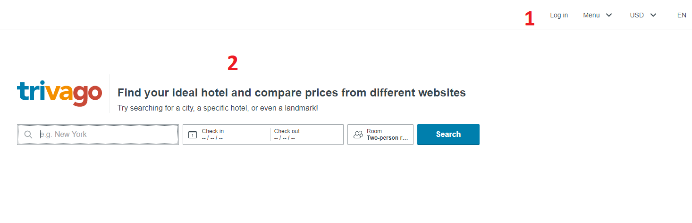
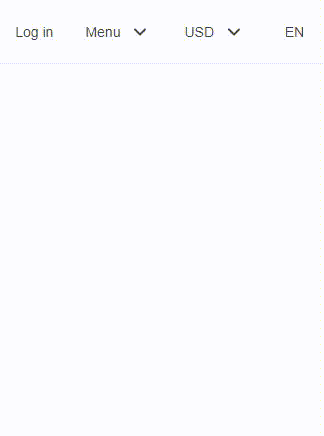
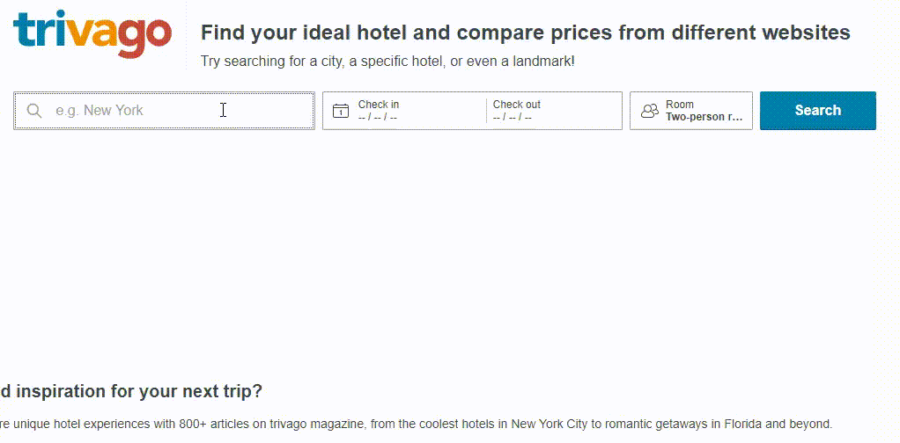
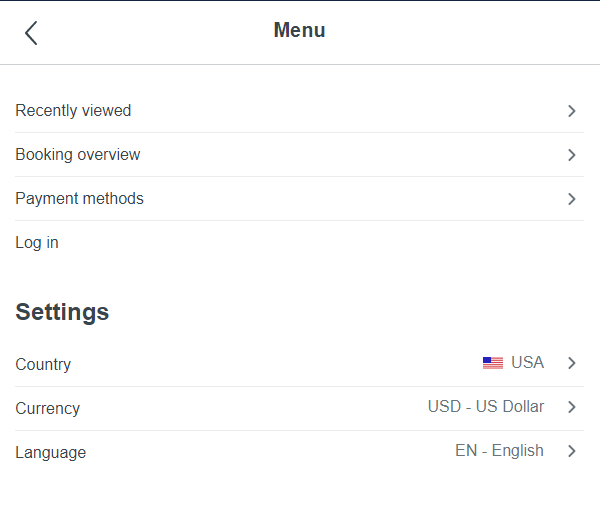

    RIA1 - Backbone
    12.02.2020

# Graphical User Interface analyses

## Mockup

### 1. Navigation bar
The navigation bar is a really simple menu.
It allows the user to :
- log in
- see : The recently viewed, Booking overview and the payment methods, through a menu
- select the currencie
- select the language

### 2. Search bar
The search bar allows to :
- pick the city
- pick the check in and check out dates
- choose the size of the room

___

## Responsive transition
Here's a demo of the responsive transition of the page. The whole page adapts to mobiles screens

On the mobile view, the menu display change. When we click on the menu toggle, it takes all the page.

Like the menu, the title of the page change. On  the mobile view, it is shortened

